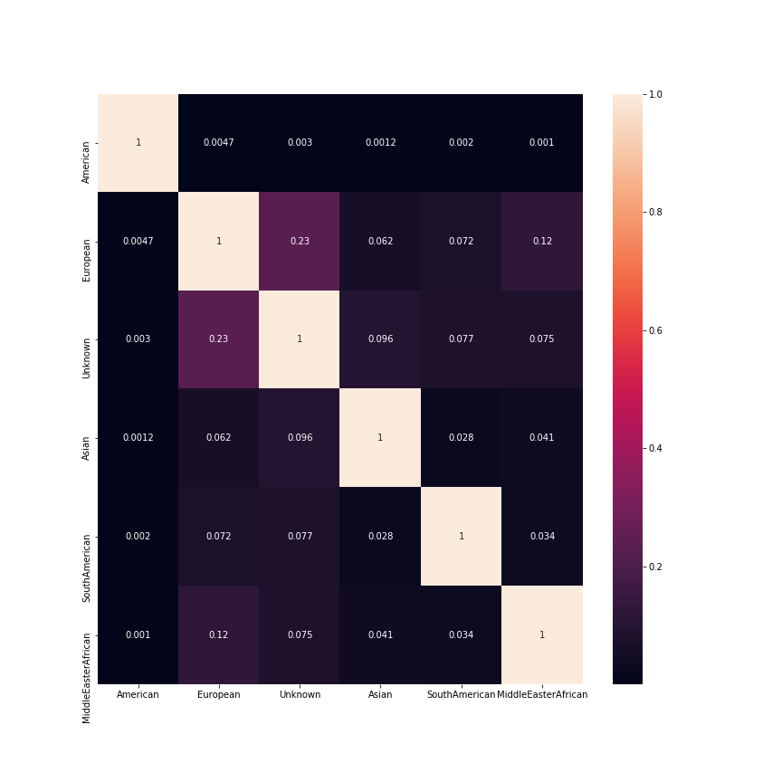

# Recipe Cuisine Type and Rating Prediction with Recipes from food52.com and epicuirous.com

# Goal
Our overarching goal for this project is to make a statement on whether the name, ingredients/recipe or general keywords from popular American food websites can help us predict if the specific recipe's rating (on a scale 0 to 4), or if the recipe belongs to a certain cuisine type (e.g. American, European, Asian, South-American, Middle-Easter/African, or Unknown).

# ETL 
**_Web Scrapping_** Our data were scrapped from all available recipes from two popular recipe website (food52.com and epicurious.com), from each recipe, we pulled the name of the recipe, ingredients, keywords, cuisine type and rating from each of the recipes.

**_Cleaning/vectorization_** None-alpha-numeric symbols and common stop-words were removed from the text (recipe name, keyword, ingredients), and transformed into a vectorized format with Count Vectorization.

  

The graph showed a clear class imbalance, as most of the cusines were American / Unknown; therefore, we had to take measures to oversample our minority class. 

  

The heat map showed that most of the corpora in each of our cuisine types are distinctive from each other. The corpus similarity was calculated with TFIDF vectorization and the similarity score was calculated with Cosine Similarity. 

# Extensive grid search to fine-tune our model accuracy
we conducted an extensive grid search to find the best model with the most optimal hyper-parameter. The algorithm searched included Random Forest, K-Nearest Neighbor, Support Vector Classifier, XGBoost Classifier. Our output was a multi-class/multilayer output (meaning the output is a vector, so we mapped vector to vector in our prediction), this was a challenging task considering the high dimensionality of our matrix. 

  

# Prediction Model 1: Using name and ingredients to predict cuisine type 
Category keys: American=0, Europe =1, Asian=2, Middle-eastern/african =3, unknown=4, south american =5
### BaggingClassifier(DecisionTreeClassifier(criterion='gini', max_depth=100), n_estimators=150)

  

Our model predicted that most recipes belong in the 'Unknown' category. 

# Prediction Model 2: Using Name, keyword and recipe to predict rating 
Rating Scale: 0-4 
### RandomForestClassifier(n_estimators=100, max_depth= 100)

  

Our model made mostly true-positive predictions on recipes with 0 rating in which the recipe actually had a 0 rating. On the other hand, the model also made a higher proportion of 0 rating predictions on a recipe that had an actual rating of 3.

# Model Performance Demonstration 
### Example 1: Predict recipe cuisine type
recipe link: https://www.allrecipes.com/recipe/13443/harira/

Predicted cuisine type: **_African__*  / Actual cuisine type: **_Middle Eastern / African_**

Input and prediction snapshot: 

  

### Example 2: Predict recipe rating

recipe link: http://allrecipes.asia/recipe/4911/saag-masoor-dal--indian-dhal-with-spinach-.aspx

Predicted rating: **_4_** / Actual rating: **_4_*

Input and prediction snapshot: 

  

# Conclusion:
Our model was able to make predictions about cuisine type and rating; however, understanding the limitations and the unique challenges of our dataset would help us navigate more ways to find the best algorithm and the best vectorization method.

# Limitation:
* Working with mostly text dataset was a challenging experience in respect to its high dimensionality in the vectorized stage. This complexity limited our vectorization method to Count Vectorization, which did not capture the inherent complexity of language and it's dependences on context.
* Our dataset was compiled from two American websites, and it was only a very minor subset of recipes, therefore, our sample needed more variety and less biased. Even though we tried to ameliorate the problem of imbalanced sample group with Random Over Sampling, it was not sufficient to overcome the intrinsic limitation of our dataset that focused on American recipes.
# Next Step:
* A deeper understanding of Neural Network, which might be able to help us explore different ways to account for the complexity of language and its reliance on context.
* With a larger dataset to work with, we might be able to overcome some of the limitations, such as imbalanced cuisine types and ratings, we experienced with the project at its current stage.
